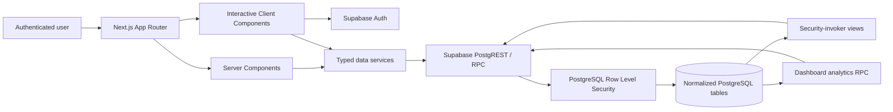

# Architecture

PipelineOS uses the Next.js App Router for the product surface and Supabase for
identity, PostgreSQL persistence, and row-level authorization.

## Frontend

- Server Components own the default page composition and initial reads.
- Client Components are limited to workflows that need interaction: command
  search, filtering, sorting, forms, optimistic writes, and charts.
- Suspense-ready boundaries and skeleton primitives support streaming without
  forcing the whole application into client rendering.
- Reusable shell, cards, buttons, badges, toolbars, charts, forms, and
  repositories avoid route-level duplication.

## Data access

`lib/data/service.ts` exposes authenticated repositories for each entity. Every
operation first verifies the Supabase user. The browser receives only the
anonymous project key; PostgreSQL RLS remains the authority for authorization.

The repository never adds inline SQL. Database behavior belongs in versioned
migrations under `supabase/migrations/`.

## Analytics

React does not aggregate raw CRM records. PostgreSQL provides:

- `monthly_revenue`
- `pipeline_by_stage`
- `deal_conversion`
- `average_sales_cycle`
- `get_dashboard_analytics()`

The RPC performs one authenticated round trip and returns chart-ready JSON.
Views use `security_invoker = true`, preserving table RLS.

## Performance

- Compound owner/date and owner/stage indexes match common filters.
- Tables paginate with bounded ranges; production defaults to 20 records.
- Joins are selected intentionally through explicit relationship projections.
- Analytics are aggregated near the data and returned in a single payload.
- Mutations use optimistic local updates with undo for destructive actions.
