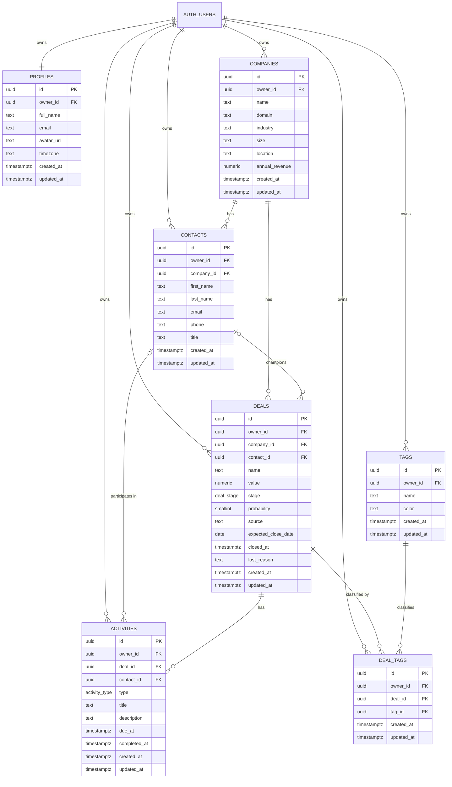

# Entity relationship diagram

```mermaid
erDiagram
  AUTH_USERS ||--|| PROFILES : "owns"
  AUTH_USERS ||--o{ COMPANIES : "owns"
  AUTH_USERS ||--o{ CONTACTS : "owns"
  AUTH_USERS ||--o{ DEALS : "owns"
  AUTH_USERS ||--o{ ACTIVITIES : "owns"
  AUTH_USERS ||--o{ TAGS : "owns"
  AUTH_USERS ||--o{ DEAL_TAGS : "owns"

  COMPANIES ||--o{ CONTACTS : "has"
  COMPANIES ||--o{ DEALS : "has"
  CONTACTS o|--o{ DEALS : "champions"
  CONTACTS o|--o{ ACTIVITIES : "participates in"
  DEALS ||--o{ ACTIVITIES : "has"
  DEALS ||--o{ DEAL_TAGS : "classified by"
  TAGS ||--o{ DEAL_TAGS : "classifies"

  PROFILES {
    uuid id PK
    uuid owner_id FK
    text full_name
    text email
    text avatar_url
    text timezone
    timestamptz created_at
    timestamptz updated_at
  }
  COMPANIES {
    uuid id PK
    uuid owner_id FK
    text name
    text domain
    text industry
    text size
    text location
    numeric annual_revenue
    timestamptz created_at
    timestamptz updated_at
  }
  CONTACTS {
    uuid id PK
    uuid owner_id FK
    uuid company_id FK
    text first_name
    text last_name
    text email
    text phone
    text title
    timestamptz created_at
    timestamptz updated_at
  }
  DEALS {
    uuid id PK
    uuid owner_id FK
    uuid company_id FK
    uuid contact_id FK
    text name
    numeric value
    deal_stage stage
    smallint probability
    text source
    date expected_close_date
    timestamptz closed_at
    text lost_reason
    timestamptz created_at
    timestamptz updated_at
  }
  ACTIVITIES {
    uuid id PK
    uuid owner_id FK
    uuid deal_id FK
    uuid contact_id FK
    activity_type type
    text title
    text description
    timestamptz due_at
    timestamptz completed_at
    timestamptz created_at
    timestamptz updated_at
  }
  TAGS {
    uuid id PK
    uuid owner_id FK
    text name
    text color
    timestamptz created_at
    timestamptz updated_at
  }
  DEAL_TAGS {
    uuid id PK
    uuid owner_id FK
    uuid deal_id FK
    uuid tag_id FK
    timestamptz created_at
    timestamptz updated_at
  }
```
